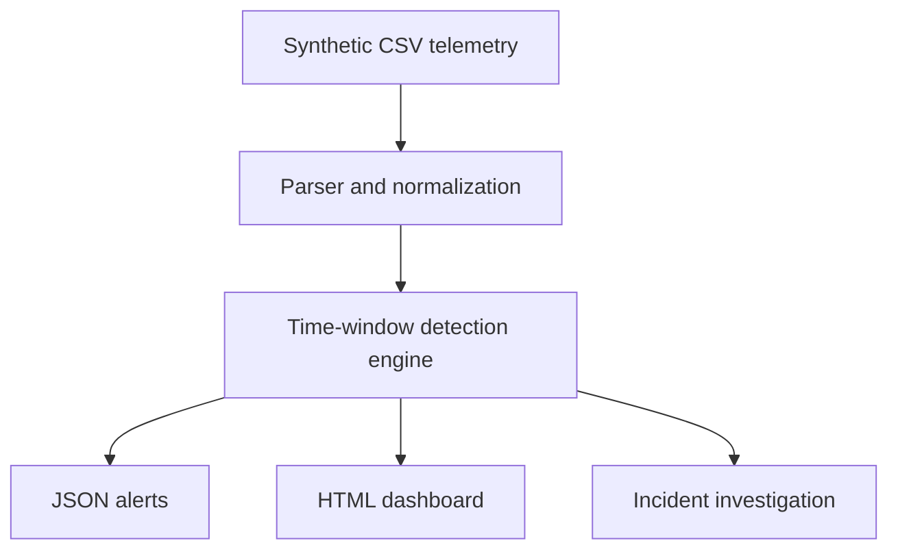

# SOC Detection Engineering Lab

[](https://github.com/jpf905/soc-detection-lab/actions/workflows/tests.yml)


A reproducible blue-team portfolio project that turns synthetic authentication telemetry into actionable alerts. It demonstrates log normalization, time-window correlation, detection engineering, MITRE ATT&CK mapping, testing, CI, incident analysis, and security reporting.


> **Ethical scope:** This repository contains defensive detection logic and synthetic data only. The reserved example IP ranges cannot identify real systems.

## What the lab detects

| Rule | Detection | Severity | ATT&CK |
| --- | --- | --- | --- |
| SOC-001 | Repeated failures against one account | High | T1110 Brute Force |
| SOC-002 | One source targets many accounts | High | T1110.003 Password Spraying |
| SOC-003 | Successful login after repeated failures | Critical | T1110, T1078 Valid Accounts |
| SOC-004 | Privileged login outside the expected country | Critical | T1078 Valid Accounts |

## Architecture



## Quick start

Requirements: Python 3.10 or newer. The runtime has no third-party dependencies.

```bash
git clone https://github.com/YOUR-USERNAME/soc-detection-lab.git
cd soc-detection-lab
python -m pip install -e .
soclab --input data/sample_auth_logs.csv --output output
```

Open `output/dashboard.html` in a browser. The command also creates `output/alerts.json` for machine-readable results.

Expected terminal summary:

```text
Analyzed 20 events and generated 4 alerts.
```

## Run the tests

```bash
python -m unittest discover -s tests -v
```

GitHub Actions repeats the test suite on Python 3.10 and 3.12 and executes the sample analysis on every push and pull request.

To validate the Sigma files locally with the same tool used in CI:

```bash
python -m pip install -e ".[dev]"
sigma check rules
```

## Repository map

```text
src/soclab/       Detection engine and reporting code
data/             Synthetic authentication telemetry
rules/            Sigma detection and correlation rules
tests/            Automated unit tests
docs/             Analyst incident report
.github/workflows Continuous integration
RESUME.md          Résumé bullets and interview explanation
MAC_SETUP.md       Beginner-friendly Mac setup and publishing guide
```

## Analyst workflow demonstrated

1. Validate and normalize raw identity telemetry.
2. Correlate authentication events within explicit time windows.
3. Assign severity and map detections to ATT&CK techniques.
4. Preserve evidence in structured JSON alerts.
5. Triage the highest-risk sequence and write an incident report.
6. Document false positives and recommended production tuning.

## Detection limitations

- Geolocation is represented by a synthetic `source_country` field; production systems should enrich source IPs through an approved provider.
- Threshold detections need environment-specific baselines and allowlists.
- This educational engine processes one local file in memory; a production design would add streaming ingestion, persistent state, access controls, and alert deduplication.
- The repository uses Sigma correlation types including `event_count`, `value_count`, and `temporal_ordered`. Backend support varies, so conversions must be tested before SIEM deployment.

## Safe ways to extend it

- Add impossible-travel logic using successive login locations and elapsed time.
- Export alerts in Elastic Common Schema or Open Cybersecurity Schema Framework format.
- Translate the rules into Splunk SPL or Elastic ES|QL and compare outputs.
- Add precision/recall measurements using labeled synthetic events.

## References

- [MITRE ATT&CK: Brute Force (T1110)](https://attack.mitre.org/techniques/T1110/)
- [MITRE ATT&CK: Valid Accounts (T1078)](https://attack.mitre.org/techniques/T1078/)
- [Sigma rule documentation](https://sigmahq.io/docs/basics/rules.html)
- [GitHub Actions: Build and test Python](https://docs.github.com/actions/guides/building-and-testing-python)

## License

MIT License. See [LICENSE](LICENSE).
